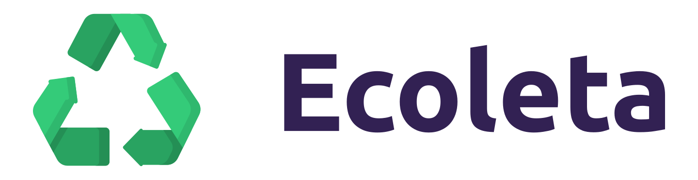
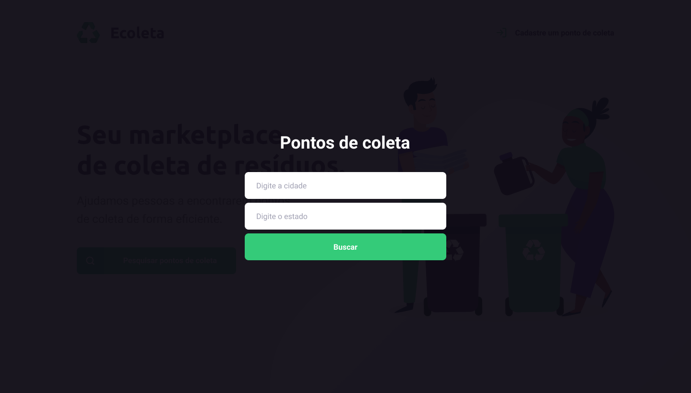
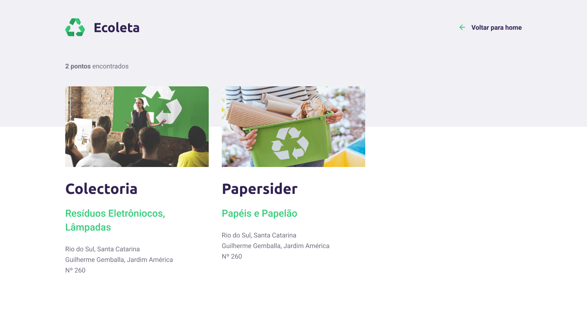
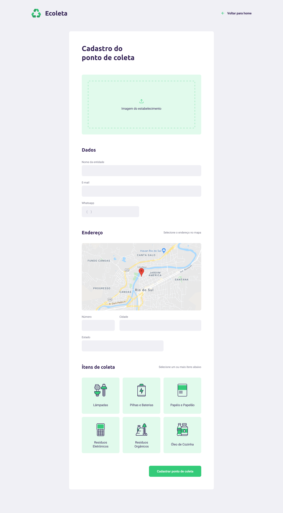
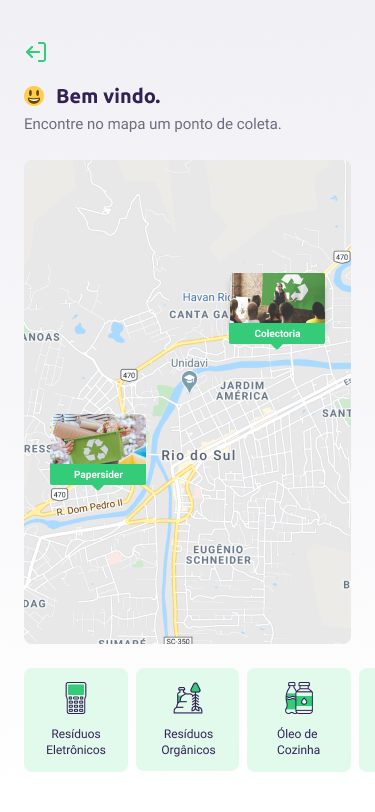
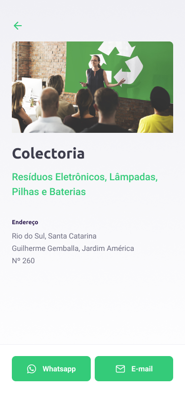
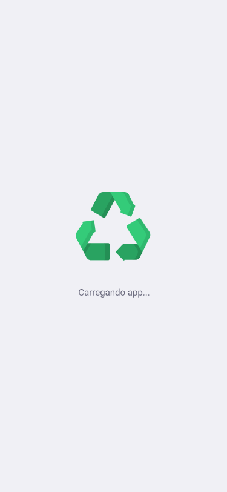

# Ecoleta

<h1 align="center">
  
</h1>

<h1 align="center">
  Seu marketplace de coleta de resíduos
</h1>

<h3 align="center">
  Back end, front end e mobile desenvolvidos do zero com frameworks e bibliotecas modernos durante a 1ª Next Level Week
</h3>

  

  

  

  

  

  

## :fallen_leaf: Sobre

**Ecoleta** é uma aplicação criada para ajudar pessoas a encontrarem empresas e pontos de coleta para reciclagem.

Esse app foi desenvolvido durante a primeira **NLW - Next Level Week** ministrada pela [Rocketseat](https://rocketseat.com.br/). O propósito desse evento é de acelerar a evolução dos devs, auxiliando no desenvolvimento técnico e pessoal com uma stack poderosa e moderna.

Na página web, as empresas e entidades poderão cadastrar informações como:

- Imagem do ponto de coleta
- Nome, email, whatsapp, estado e cidade
- Itens de coleta

No aplicativo mobile, os usuários poderão navegar pelo mapa para encontrarem instituições próximas e entrar em contato via e-mail ou whatsapp.

## :art: Layout

### :computer: Web

  
    
    
    
  

  
    
  

### :iphone: Mobile

  
    
  
  
    
  
  
    
  
  
    
  

## :rocket: Tecnologias

### Front end & Mobile

- [React](https://reactjs.org/)
- [React Native](https://reactnative.dev/)
- [Styled Components](https://styled-components.com/)
- [Typescript](https://www.typescriptlang.org/)
- [Leaflet](https://leafletjs.com/)
- [React Leaflet](https://react-leaflet.js.org/)
- [React Icons](https://react-icons.netlify.com/)
- [React Dropzone](https://react-dropzone.js.org/)
- [React Router](https://reacttraining.com/react-router/)
- [Axios](https://github.com/axios/axios)
- [Expo](https://expo.io/)
- [VS Code][vc] com [EditorConfig][vceditconfig], [ESLint][vceslint] e [Prettier][vcprettier]

### Back end

- [Express](https://github.com/expressjs/express)
- [Typescript](https://www.typescriptlang.org/)
- [TS Node](https://github.com/TypeStrong/ts-node)
- [Celebrate](https://github.com/arb/celebrate)
- [Cors](https://www.npmjs.com/package/cors)
- [Knex](http://knexjs.org/)
- [SQLite3](https://www.npmjs.com/package/sqlite3)
- [Multer](https://github.com/expressjs/multer)
- [VS Code][vc] com [EditorConfig][vceditconfig], [ESLint][vceslint] e [Prettier][vcprettier]

## Como contribuir

- Faça um **fork** desse repositório
- Crie uma branch com a sua feature: `git checkout -b my-feature`
- Envie suas alterações para a _staging area_: `git add .`
- Faça um commit contando o que você fez: `git commit -m "feat: my new feature!"`
- Envie para o Github: `git push origin my-feature`

> Caso tenha alguma dúvida confira este [guia de como contribuir no GitHub](https://github.com/firstcontributions/first-contributions)

## :memo: License

Esse projeto está sob a licença MIT. Consulte [LICENSE](https://github.com/Bonizario/be-the-hero/blob/master/LICENSE) para mais informações.

---

Desenvolvido por [Gabriel Bonizario](https://www.linkedin.com/in/gabriel-bonizario/) 👋🏻

[vc]: https://code.visualstudio.com/
[vceditconfig]: https://marketplace.visualstudio.com/items?itemName=EditorConfig.EditorConfig
[vceslint]: https://marketplace.visualstudio.com/items?itemName=dbaeumer.vscode-eslint
[vcprettier]: https://marketplace.visualstudio.com/items?itemName=esbenp.prettier-vscode
